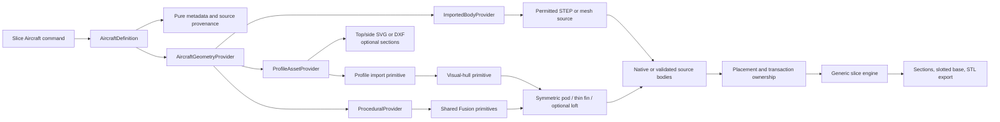

# Geometry provider architecture

This target architecture follows [ADR 0001](adr/0001-aircraft-geometry-sources.md).
It separates pure aircraft information from reusable Fusion operations and from
the future fabrication pipeline.



## Ownership boundaries

| Layer | Owns | Must not own |
| --- | --- | --- |
| Aircraft package | Metadata, dimensions, source provenance, profile assets, optional sections | Fusion API calls or slicing mechanics |
| Geometry provider | Source acquisition and high-level build choice | Command UI decisions |
| Geometry primitive | Reusable native Fusion operation | Aircraft-specific proportions or branding |
| Transaction | Part/Hybrid placement, created-object ownership, rollback, browser cleanup | Aircraft shape decisions |
| Slice engine | Section construction and multi-body section combination | Aircraft-specific modeling |

## Default aircraft contribution

```text
metadata + dimensions + top outline + side outline
  + optional cross-sections / pods / fins
  + custom builder only when shared providers cannot express the shape
```

The first provider proof of concept uses a fictional delta aircraft and ten
transverse-section checks before real SR-71 assets are introduced.
